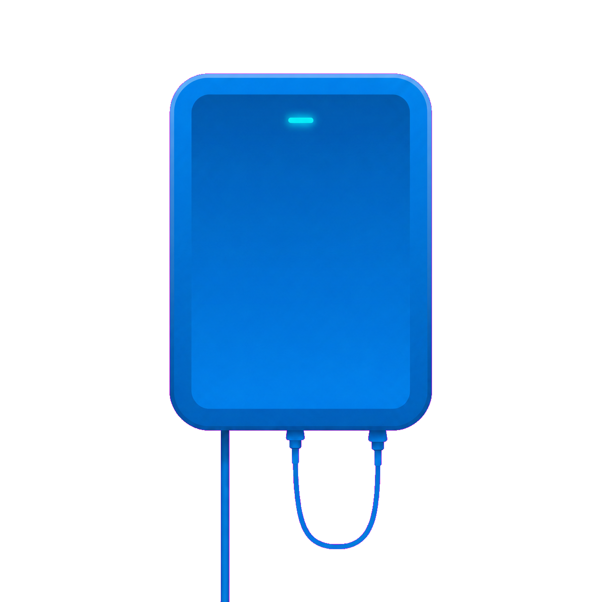

# C5500XK Bluetooth LE research
> tl;dr: some Quantum Fiber (previously CenturyLink, now AT&T)  SmartNID units expose a BLE diagnostic surface that can be used for monitoring and reset without proper authentication. This can be done remotely without any info about the ONT. 



> [!NOTE]
> **How this was accomplished:** firmware `CKX002-02.01.19.00` was extracted,
> the C5500XK platform manager and BLE daemon were mapped statically, the live
> proprietary GATT database was enumerated with BlueZ, and the recovered
> application-authentication construction was validated against a live unit by
> reading protected WAN and PON telemetry.
>
> **Major verified issues:** the tested firmware contains a recoverable static
> application-authentication prefix; the other hash inputs are visible in the
> BLE local name and manufacturer advertisement; a valid authentication payload
> was independently generated from those inputs; and the authenticated GATT
> surface includes writable characteristics mapped by the firmware to reboot,
> factory reset, WAN lease, PPP credential, ping, upload-test, and download-test
> operations. Only the authentication characteristic was written during this
> research. No operational command was executed.

This repository documents the proprietary Bluetooth LE interface exposed by a
Gemtek C5500XK optical network terminal (ONT). All device-specific identifiers
have been removed.

## Scope and tested version

| Item                                | Verified value                                                     |
| ----------------------------------- | ------------------------------------------------------------------ |
| Product                             | Gemtek C5500XK                                                     |
| Firmware image                      | `CKX002-02.01.19.00.bin`                                           |
| Firmware SHA-256                    | `5c41b77b3c7bebe8991c682927c6fa300ed51a0f4cd573757a558bd725d14eaa` |
| Live validation date                | 2026-07-14                                                         |
| BLE services                        | 3 proprietary services                                             |
| GATT characteristics                | 73                                                                 |
| Standard Device Information service | Not exposed                                                        |

The firmware image, extracted root filesystem, packet captures, client-host
configuration, and device credentials are not included.

## Home Assistant integration

This repository is also a HACS-compatible custom integration backed by a
standalone direct-BlueZ collector. The collector runs on a Linux host with a
physical Bluetooth adapter; Home Assistant polls its token-authenticated local
HTTP API. Home Assistant Bluetooth and ESPHome Bluetooth proxies are not used.

The integration:

- scans for the configured `C5500XK` with BlueZ on the collector host;
- reconstructs the current token from the unaggregated raw advertisement;
- requests encrypted BLE pairing directly from the collector host;
- performs the verified application-authentication write;
- reads WAN, PON, optical-level, counter, error, discard, and ping-result data;
  and
- exposes operational controls only as opt-in, disabled-by-default entities.

### Install with HACS

1. In HACS, open **Integrations**, choose **Custom repositories**, and add
   `https://github.com/lrehmann/c5500xk-ble-research` as an **Integration**.
2. Install **Quantum Fiber ONT Bluetooth** and restart Home Assistant.
3. Install and configure the direct-Bluetooth collector on a nearby Linux host
   using [`collector/config.example.json`](collector/config.example.json) and
   [`collector/c5500xk-collector.service`](collector/c5500xk-collector.service).
4. Open **Settings → Devices & services → Add integration**, search for
   **Quantum Fiber ONT Bluetooth**, and enter the collector host, API token, and
   ONT identifiers.

### Safety boundary

Monitoring is enabled when the integration is added. Operational writes are
not: `allow_writes` defaults to `false` in the collector, the integration option
**Enable operational write actions** defaults to off, and every write button
defaults to disabled in the entity registry.

The shipped buttons are based on exact firmware mappings and encodings:

- reboot: one-byte boolean `01`;
- factory reset: one-byte boolean `01`;
- release/renew WAN address: one-byte boolean `01`;
- reset PPP credentials: one-byte boolean `01`; and
- ping: ASCII host, little-endian 32-bit payload size and repetition count,
  followed by ASCII `Requested` in the diagnostic-state characteristic.

None of those operational buttons was pressed during development or live
validation. See [`docs/home-assistant.md`](docs/home-assistant.md) for the
entity list, timing behavior, and validation boundary.

## Verified findings

### 1. Two authentication layers are present

The tested unit completed Bluetooth LE encrypted pairing and then enforced a
second application-authentication check. Pairing alone exposed the GATT layout,
but protected values were not returned until the application-authentication
payload was accepted.

The application-authentication write uses characteristic value handle
`0x0005`, UUID `b5ef5c81-e7ec-412d-8d3b-a22bfd5f0bf1`.

### 2. The application-authentication payload is reproducible

The platform manager generates a six-character value from an 88-character
alphabet and appends the fixed suffix `01`. The resulting eight bytes are sent
in a manufacturer-specific advertisement.

The expected 32-byte authentication digest is:

```text
SHA256(auth_prefix || ASCII(device_serial) || advertised_token_8_bytes)
```

The client writes 64 raw bytes to handle `0x0005`:

```text
authentication_digest_32_bytes || nonce_32_bytes
```

The tested firmware's `auth_prefix` was recovered by decrypting its embedded
`BlePasskeyGenerator` data. The complete static derivation and independently
validated implementation are documented in
[`docs/authentication.md`](docs/authentication.md) and
[`tools/derive_c5500xk_auth.py`](tools/derive_c5500xk_auth.py).

### 3. BlueZ splits the advertised token

The advertisement uses AD type `0xff`. BlueZ interprets the first two payload
bytes as a little-endian manufacturer company identifier and presents only the
remaining six bytes as the manufacturer value. The original eight-byte token
is reconstructed as:

```text
little_endian_u16(ManufacturerData Key) || ManufacturerData Value
```

Using only the six displayed value bytes produces the wrong digest.

### 4. Authentication is time-limited

In the captured failed session, encrypted pairing completed, service discovery
finished, and the authentication write was transmitted about 10.15 seconds
after encryption. The ONT disconnected immediately afterward.

In the successful session, a pre-armed process sent the application payload as
soon as BlueZ reported both `Connected=true` and `ServicesResolved=true`. The
ONT remained connected and returned protected RG and PON values.

The advertised token changed after failed/disconnected sessions. Each session
therefore used a freshly observed token.

### 5. Three proprietary services are exposed

| Service        | UUID                                   | Function                                                                  |
| -------------- | -------------------------------------- | ------------------------------------------------------------------------- |
| RG data        | `b5ee5c80-e7ec-412d-8d3b-a22bfd5f0bf1` | Identity, firmware, WAN state, interface state, counters, PPP credentials |
| RG diagnostics | `5540ced9-014f-4118-9bc4-f47747172711` | Device commands and ping/upload/download diagnostics                      |
| PON data       | `4d84d94f-7fc1-43ac-8fab-a6a7f03b9b58` | PON identity, state, optics, counters, errors, discards                   |

The complete characteristic map is in [`docs/gatt-map.md`](docs/gatt-map.md).

## Anonymized live validation

The following values were returned only after the independently generated
application-authentication payload was accepted.

| Field                             | Value                      |
| --------------------------------- | -------------------------- |
| BLE address                       | `<REDACTED_BLE_ADDRESS>`   |
| Device serial                     | `<REDACTED_DEVICE_SERIAL>` |
| PON FSAN                          | `<REDACTED_PON_FSAN>`      |
| WAN IPv4                          | `<REDACTED_WAN_IPV4>`      |
| Hardware version                  | `1.1`                      |
| Software version                  | `CKX002-02.01.19.00`       |
| WAN status                        | `Up`                       |
| IPv4 packets sent                 | `1,043,583`                |
| IPv4 packets received             | `1,038,862`                |
| IPv4 link uptime                  | `49,468 seconds`           |
| Downstream train rate             | `0`                        |
| Upstream train rate               | `0`                        |
| PON status                        | `Up`                       |
| PON status elapsed value          | `49,470 seconds`           |
| RX optical level                  | `-18.326 dBm`              |
| RX lower / upper thresholds       | `-30.000 / -7.000 dBm`     |
| TX optical level                  | `2.460 dBm`                |
| TX lower / upper thresholds       | `-16.000 / 10.000 dBm`     |
| PON bytes sent                    | `3,901,821,179`            |
| PON bytes received                | `1,537,119,130`            |
| PON BIP errors                    | `0`                        |
| PON packet errors sent / received | `0 / 0`                    |
| PON discards sent / received      | `0 / 0`                    |

The zero train-rate values were returned by the RG data service on this PON
deployment. They are reproduced here without assigning an unverified meaning.

## Writable surface

The live GATT properties and firmware mapping identify 21 characteristics with
write-without-response (`WNR`) rights:

- application authentication;
- PPP username and password;
- reboot, factory reset, WAN release/renew, and PPP-credential reset commands;
- ping destination, payload size, repetition count, and diagnostic state;
- upload-test URL, file length, duration, connection count, and diagnostic
  state; and
- download-test URL, file length, duration, connection count, and diagnostic
  state.

No PON data characteristic is writable. Optical levels, thresholds, state,
counters, errors, and discards are read-only or read/notify.

Except for handle `0x0005`, no writable characteristic was exercised. The
operational command payload values and state enums were therefore not validated
and are not presented as working commands in this repository.

## Value encoding observed live

| Data                                              | Encoding                                                     |
| ------------------------------------------------- | ------------------------------------------------------------ |
| Serial, firmware versions, status, WAN IPv4, FSAN | ASCII byte string                                            |
| Packet/byte counters                              | Little-endian unsigned integers                              |
| Uptime/status elapsed values                      | Little-endian unsigned 32-bit seconds                        |
| Optical levels and thresholds                     | Little-endian signed 32-bit integer divided by 1,000, in dBm |

## Research boundary

The live validation was deliberately read-focused. The only GATT write was the
required application-authentication payload. Reboot, factory reset, WAN lease,
PPP, ping, upload, and download controls were not invoked. The temporary BLE
bond was removed after validation, and the client adapter was left disconnected
and not discovering.

Model evidence and the deliberately conservative discovery policy are recorded
in [`docs/model-support.md`](docs/model-support.md).
